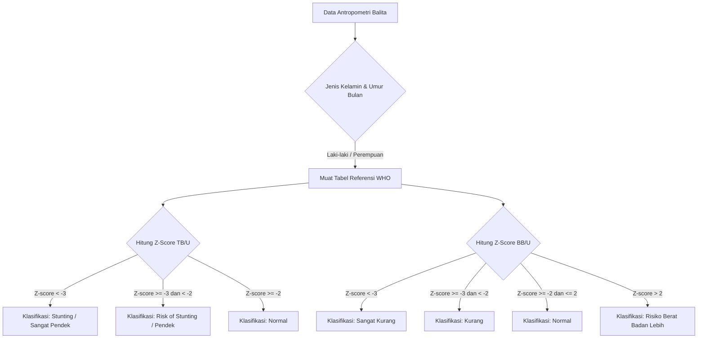

# DOKUMENTASI SISTEM INFORMASI eSSTUNTING
### KELURAHAN SUKAHAJI (KECAMATAN BABAKAN CIPARAY - KOTA BANDUNG)

> **Referensi Akademik Pendukung:**
> - **Penulis Skripsi:** Marsha Nabila Lestari Dewi (NIM: 22110630)
> - **Judul Skripsi:** *Klasifikasi Status Stunting Balita Menggunakan Algoritma Decision Tree di Kelurahan Sukahaji*
> - **Institusi:** Program Studi Teknik Informatika, Sekolah Tinggi Manajemen Informatika dan Komputer (STMIK) Mardira Indonesia, 2026.

---

## 1. PENDAHULUAN & LATAR BELAKANG

Sistem **eSStunting** dikembangkan untuk mengatasi kendala konvensional dalam pencatatan dan analisis tumbuh kembang balita di Kelurahan Sukahaji. Di Kelurahan Sukahaji terdapat **21 Posyandu** yang aktif mengumpulkan data tumbuh kembang balita secara periodik. 

### Permasalahan Utama di Lapangan (Bab 1 - Latar Belakang):
*   **Proses Manual & Lambat:** Kader Posyandu melakukan pencatatan dan klasifikasi status gizi balita menggunakan prosedur konvensional. Hal ini memakan waktu dan berpotensi memicu kesalahan hitung (*human error*).
*   **Keterbatasan Pemetaan:** Distribusi intervensi bantuan gizi dari pihak Kelurahan terkadang terlambat akibat lambatnya proses rekapitulasi data dari 21 Posyandu.
*   **Kurangnya Transparansi Aturan:** Diperlukannya model komputasi yang dapat menyajikan alur logika keputusan yang jelas (*if-then rules*) dan transparan untuk pengguna non-teknis (kader dan staff Kesos).

---

## 2. SPESIFIKASI TEKNOLOGI SISTEM

Aplikasi eSStunting dibangun dengan arsitektur web modern yang andal, aman, dan responsif:

*   **Backend Framework:** Laravel 12.x (PHP 8.2+)
*   **Frontend UI:** HTML5, CSS3, Tailwind CSS v4.0 (melalui integrasi Vite)
*   **Database Engine:** MySQL / MariaDB
*   **Modul Ekspor Data:** OpenSpout v4 (XLSX Writer) untuk laporan Excel yang cepat dan hemat memori, dan DomPDF v3 untuk kompilasi laporan cetak PDF resmi.
*   **Autentikasi:** Laravel Session Authentication dengan sistem multi-role kustom.

---

## 3. CAKUPAN & BATASAN MASALAH (IMPLEMENTASI SISTEM)

Sesuai dengan batasan masalah pada proposal skripsi (Bab 1.3):

1.  **Lokasi Spesifik:** Wilayah Kelurahan Sukahaji, Kecamatan Babakan Ciparay, Kota Bandung (meliputi data dari 21 Posyandu).
2.  **Algoritma Utama:** Implementasi pohon keputusan (*Decision Tree*) berbasis tabel referensi standar World Health Organization (WHO) dan Kementerian Kesehatan RI (Permenkes No. 2 Tahun 2020).
3.  **Atribut Antropometri:** Memproses atribut utama: Usia (Bulan), Jenis Kelamin, Tinggi Badan (cm), dan Berat Badan (kg).
4.  **Kategori Output Klasifikasi:**
    *   **Status Stunting (Indeks TB/U):** *Normal*, *Risk of Stunting (Pendek)*, dan *Stunting (Sangat Pendek)*.
    *   **Status Berat Badan (Indeks BB/U - Ekstensi Sistem):** *Sangat Kurang*, *Kurang*, *Normal*, dan *Risiko Berat Badan Lebih*.
5.  **Batasan Non-Medis:** Aplikasi hanya bertindak sebagai sistem pendukung keputusan pendeteksi dini (*data mining* & klasifikasi), tidak memberikan resep medis atau intervensi klinis langsung.

---

## 4. LOGIKA KLASIFIKASI & ALGORITMA DECISION TREE

Klasifikasi tumbuh kembang balita menggunakan metode *Decision Tree* yang mereplikasi pohon keputusan standar Z-Score WHO. 

### 4.1 Perhitungan Z-Score
Penghitungan Z-Score pada sistem dilakukan menggunakan rumus standar antropometri:
$$Z\text{-Score} = \frac{\text{Nilai Riil Balita} - \text{Nilai Median Referensi}}{\text{Nilai Deviasi Standar Referensi (SD)}}$$

*   Jika **Nilai Riil > Median**, pembagi menggunakan selisih (+1 SD - Median).
*   Jika **Nilai Riil < Median**, pembagi menggunakan selisih (Median - -1 SD).

### 4.2 Struktur Aturan Keputusan (If-Then Rules)
Aturan keputusan dari pohon keputusan sistem dirancang sebagai berikut:



### 4.3 Validasi Pintar Batasan Masukan (Mencegah Human Error)
Untuk mencegah kader salah memasukkan angka yang tidak realistis (misalnya berat 1 kg pada usia 12 bulan), sistem melakukan validasi rentang dinamis berdasarkan acuan pertumbuhan ekstrem WHO:

| Rentang Usia | Batas Tinggi Badan (TB) | Batas Berat Badan (BB) |
| :--- | :--- | :--- |
| **0 - 6 Bulan** | $40.0\text{ cm} - 80.0\text{ cm}$ | $1.5\text{ kg} - 12.0\text{ kg}$ |
| **7 - 12 Bulan** | $55.0\text{ cm} - 95.0\text{ cm}$ | $4.0\text{ kg} - 15.0\text{ kg}$ |
| **13 - 24 Bulan** | $65.0\text{ cm} - 110.0\text{ cm}$ | $5.5\text{ kg} - 20.0\text{ kg}$ |
| **25 - 36 Bulan** | $70.0\text{ cm} - 120.0\text{ cm}$ | $7.0\text{ kg} - 25.0\text{ kg}$ |
| **37 - 60 Bulan** | $80.0\text{ cm} - 130.0\text{ cm}$ | $9.0\text{ kg} - 35.0\text{ kg}$ |

---

## 5. SKEMA DATABASE & STRUKTUR DATA (ERD MAPPING)

Sistem menggunakan 4 tabel utama yang saling berelasi:

### 5.1 Tabel `posyandus`
Menyimpan data posyandu di Kelurahan Sukahaji.
*   `id` (BigInt, PK)
*   `nama` (Varchar): Nama Posyandu (contoh: Melati 1, Dahlia 2).
*   `rw` (Varchar): Lokasi rukun warga (contoh: RW 01).

### 5.2 Tabel `balitas`
Menyimpan data profil balita yang terdaftar.
*   `id` (BigInt, PK)
*   `posyandu_id` (BigInt, FK): Terhubung ke `posyandus.id`.
*   `nama` (Varchar): Nama lengkap balita.
*   `nik` (Varchar, Unique): Nomor Induk Kependudukan balita.
*   `jenis_kelamin` (Enum: `L`, `P`).
*   `tanggal_lahir` (Date).
*   `nama_ortu` (Varchar): Nama orang tua/wali.

### 5.3 Tabel `pemeriksaans`
Menyimpan riwayat antropometri bulanan dan klasifikasi status gizi.
*   `id` (BigInt, PK)
*   `balita_id` (BigInt, FK): Terhubung ke `balitas.id`.
*   `posyandu_id` (BigInt, FK): Terhubung ke `posyandus.id`.
*   `umur_bulan` (Int): Usia saat diperiksa.
*   `tanggal_pemeriksaan` (Date).
*   `tinggi_badan` (Decimal 5,2): Tinggi balita dalam cm.
*   `berat_badan` (Decimal 5,2): Berat balita dalam kg.
*   `zscore_tb_u` (Decimal 5,2): Nilai Z-score Tinggi Badan menurut Umur.
*   `status_stunting` (Enum: `Normal`, `Risk of Stunting`, `Stunting`).
*   `zscore_bb_u` (Decimal 5,2): Nilai Z-score Berat Badan menurut Umur.
*   `status_berat_badan` (Enum: `Sangat Kurang`, `Kurang`, `Normal`, `Risiko Berat Badan Lebih`).
*   `catatan` (Text, Nullable).

### 5.4 Tabel `users`
Menyimpan data pengguna dengan hak akses multi-role.
*   `id` (BigInt, PK)
*   `name` (Varchar)
*   `email` (Varchar, Unique)
*   `password` (Varchar)
*   `role` (Enum: `kelurahan`, `posyandu`)
*   `posyandu_id` (BigInt, FK, Nullable): Khusus untuk role `posyandu`.

---

## 6. HAK AKSES SISTEM (USER ROLES & PERMISSIONS)

Aplikasi memiliki pembatasan hak akses yang jelas antara pihak Kelurahan dan Kader Posyandu untuk menjaga integritas data:

```
┌────────────────────────────────────────────────────────┐
│                   eSStunting System                    │
└───────────────────────────┬────────────────────────────┘
                            │
            ┌───────────────┴───────────────┐
            ▼                               ▼
  ┌──────────────────┐            ┌──────────────────┐
  │  Role Kelurahan  │            │  Role Posyandu   │
  └─────────┬────────┘            └─────────┬────────┘
            │                               │
            ├─► Lihat Semua Posyandu        ├─► Input Balita Posyandu Sendiri
            ├─► Lihat Klasifikasi Total     ├─► Input Pemeriksaan Bulanan
            ├─► Ekspor Laporan PDF/XLSX     ├─► Monitor Riwayat Balita Posyandu
            └─► Re-Klasifikasi Masal        └─► Edit Profil Mandiri
```

1.  **Akses Kelurahan (Admin - Kantor Kelurahan Sukahaji):**
    *   Melihat dashboard statistik agregat stunting dari seluruh posyandu di wilayah Sukahaji.
    *   Memantau daftar 21 Posyandu beserta rincian balita di dalamnya.
    *   Melakukan kalkulasi ulang (*Re-Klasifikasi*) masal jika terdapat perubahan standar acuan data referensi.
    *   Mengekspor laporan berkala dalam format PDF (desain tanda tangan Lurah Sukahaji resmi) dan Excel (kop surat lengkap dengan rincian data balita).
    *   Mengakses halaman edit profil mandiri.
2.  **Akses Posyandu (Petugas/Kader Posyandu):**
    *   Hanya dapat melihat dan mengelola balita serta pemeriksaan di dalam Posyandu tempat akunnya bertugas.
    *   Melakukan CRUD data balita baru dan meng-input data pemeriksaan bulanan.
    *   Menerapkan validasi batasan masukan antropometri secara real-time saat mengisi form pemeriksaan.
    *   Mengakses halaman edit profil mandiri (Nama, Email/Gmail, dan Password).

---

## 7. TEKNIK PENGEMBANGAN SISTEM (MAPPING METODE)

### 7.1 Cross-Industry Standard Process for Data Mining (CRISP-DM)
1.  **Business Understanding:** Menganalisis kebutuhan efisiensi pelacakan stunting di Kelurahan Sukahaji yang mencakup 21 Posyandu.
2.  **Data Understanding:** Mengumpulkan data balita, memahami variabel usia, tinggi badan, berat badan, dan jenis kelamin.
3.  **Data Preparation:** Menangani data kosong (*missing values*) dan mengonversi parameter usia ke bentuk bulan.
4.  **Modeling:** Mengembangkan logika klasifikasi *decision tree* menggunakan percabangan aturan acuan tabel median WHO.
5.  **Evaluation:** Melakukan pengujian akurasi hasil klasifikasi sistem dibandingkan dengan perhitungan manual standar WHO (menargetkan kecocokan 100% pada formula matematis Z-score).
6.  **Deployment:** Mengintegrasikan model logika klasifikasi ke dalam aplikasi web Laravel agar dapat langsung digunakan oleh kader dan staf kelurahan.

### 7.2 Object-Oriented Analysis and Design (OOAD) & UML
Desain perangkat lunak dimodelkan secara terstruktur dengan diagram Unified Modeling Language (UML):
*   **Use Case Diagram:** Memetakan aksi aktor kelurahan (melihat laporan, klasifikasi ulang) dan aktor posyandu (entri balita, entri pemeriksaan).
*   **Class Diagram:** Merepresentasikan struktur model Eloquent Laravel (`Posyandu`, `Balita`, `Pemeriksaan`, `User`) beserta relasi *one-to-many* antar kelas.
*   **Activity/Sequence Diagram:** Menggambarkan urutan jalannya proses input data balita oleh kader hingga sistem mengeluarkan hasil klasifikasi Z-Score secara instan.

---
*Dokumentasi ini disusun secara komprehensif sebagai panduan pengembangan teknis sistem eSStunting sekaligus pelengkap bab rancangan sistem pada laporan skripsi.*
